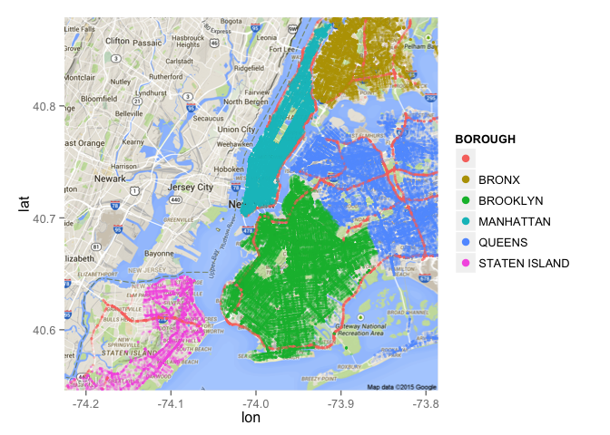
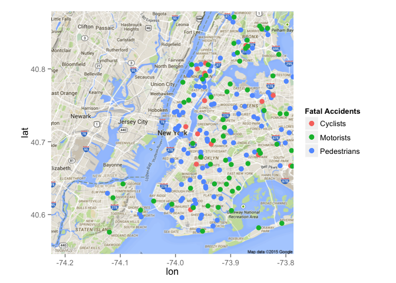

# NYC Collision Data Investigation
In this analysis I look at data from the NYPD Collisions Data Set for 2014 and 2015 through February 10.


This code loads the necessary packages for the analysis


```r
library(ggplot2)
library(ggmap)
library(dplyr)
data = read.csv('NYPD_MOTOR_VEHICLE_COLLISIONS.csv', sep = ",")
```

First I compared the string (latitude, longitude) column to the individual numeric columns:


```r
split <- substring(as.character(data$LOCATION),2)
split <- substring(split,1,nchar(split)-1)
lat <- as.numeric(substr(split,1,regexpr(",",split)-1))
long <- as.numeric(substr(split,regexpr(",",split)+1, nchar(split)))
identical(data$LATITUDE, lat)
```

```
## [1] TRUE
```

```r
identical(data$LONGITUDE, long)
```

```
## [1] TRUE
```

Looks like both latitude and longitude values are the same in both columns. No errors here!

To start I plotted collisions by borough in the charts below:


```r
nyc <- ggplot(data, aes(LONGITUDE, LATITUDE, color = BOROUGH))
nyc + geom_point(alpha = 0.2, size = 1) + guides(color = guide_legend(override.aes = list(alpha = 1, size = 3)))
```

 

```r
nycmap <- get_map("New York City", zoom=11)
nyc1 <- ggmap(nycmap)
nyc1 <- nyc1 + geom_point(data=data, aes(LONGITUDE, LATITUDE, color = BOROUGH), alpha = .2, size = 1)
nyc1 <- nyc1 + guides(color = guide_legend(override.aes = list(alpha = 1, size = 3)))
nyc1
```

 

Now I have a look at fatal accidents broken down by who was killed (i.e. cyclist, motorist, or pedestrian)


```r
killedped=subset(data,NUMBER.OF.PEDESTRIANS.KILLED > 0)
killedcyc=subset(data,NUMBER.OF.CYCLIST.KILLED > 0)
killedmot=subset(data,NUMBER.OF.MOTORIST.KILLED > 0)
nycmap <- get_map("New York City", zoom=11)
nyc1 <- ggmap(nycmap)
nyc1 <- nyc1 + scale_color_discrete(name = "Fatal Accidents") +
  geom_point(data=killedped, aes(LONGITUDE, LATITUDE, color = 'Pedestrians'), size=3) +
  geom_point(data=killedcyc, aes(LONGITUDE, LATITUDE, color = 'Cyclists'), size=3) +
  geom_point(data=killedmot, aes(LONGITUDE, LATITUDE, color = 'Motorists'), size=3)
nyc1
```

 

Now I am going to look at accidents by time of day and borough


```r
ggplot(data, aes(x=format(as.POSIXct(as.character(data$TIME), format = "%H:%M"), "%H:%M"))) + 
  geom_density(aes(group=BOROUGH, colour=BOROUGH, fill=BOROUGH), alpha=0.2) +
  scale_x_discrete(breaks=c('00:00', '04:00','08:00','12:00','16:00','20:00')) +
  xlab('Time of day')
```

 

Looks like most accidents happen between around 6am and 7pm. There are slightly fewer accidents in the middle of the day while people are at work. There is also somewhat of a peak around 1am when people may be returning home from bars.
